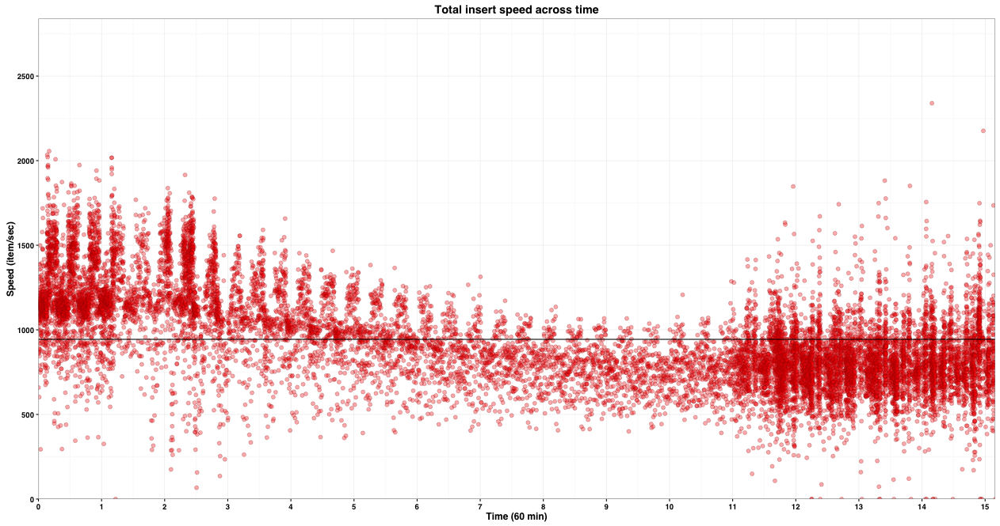

# Disclaimer

This indexer is for you if you have:
- A powerful spare computer with a lot of RAM, ideally 16GB to dedicate fully to the task
- At least 300 GB storage
- Unlimited bandwidth
- Knowledge in MySQL (How to write MySQL queries, table optimization, index creation, db maintenance)

# Introduction

High performance multithreaded indexer for the Path of Exile Stash API coded in C++11.

JSON files are pre-downloaded ahead through a first thread. In a second thread, downloaded files are parsed and data inserted into the database. Insertion leverages the [LOAD DATA INFILE](http://dev.mysql.com/doc/refman/5.7/en/load-data.html) MySQL statement for increased insertion speed.

# How it works

Two threads are used: 

- The first one, *download_loop* downloads JSON changes at a regular interval
- The second one, *processing_loop* parses these files and insert data into the database

As files are downloaded through the first thread, their name is added to a queue. This queue is read by the second thread which progressively parses the corresponding files.

The second thread iterates over stashes, inserting items one by one. Item properties (properties, affixes, requirements and sockets) are however stored for a delayed insertion. When a certain amount of JSON files have been parsed, item properties are written to text files and inserted through 4 different threads (properties, affixes, requirements and sockets).

# Libraries used

JSON files are downloaded with gzip compression using [libCurl](https://curl.haxx.se/libcurl/).

The [RapidJSON](http://rapidjson.org/) library is used to parse JSON files.

Storage is done through MySQL (see schema.sql) and the interface with MySQL is done through the [Connector/C++](https://dev.mysql.com/downloads/connector/cpp/1.1.html) library, the official MySQL C++ communication API.

# Performances

**Hardware**

Hardware Intel Xeon W3520 (4 cores / 8 threads at 2.66 GHz+)	with 16 Go RAM and SSD storage.

**MySQL settings**

    innodb_buffer_pool_size = 12G
    innodb_log_file_size = 2047M
    innodb_flush_log_at_trx_commit = 2
    innodb_flush_method = O_DIRECT
    innodb_file_per_table=1
    innodb_stats_on_metadata = OFF
    innodb_buffer_pool_instances = 8
    query_cache_type = 0
    innodb_lock_wait_timeout = 50
    innodb_log_buffer_size = 8M

**Results**

The indexer memory consumption is very small, about 300 MB (2%).

The plot below shows the evolution of item insertion speed across time.

# Installing required libraries

The first thing you need is to have a running MySQL installation correctly tuned for your hardware.

To run the indexer, you will need to install the required dependencies:

- LibCurl
- RapidJSON
- Connector/C++

## MacOS
On MacOS, download [Mysql-c++-connector](https://dev.mysql.com/downloads/connector/cpp/1.1.html). Extract the archive and copy the content of the `lib` folder to `/usr/local/lib`, and the content of the `include` folder to `/usr/local/include`. Next, download [RapidJSON](http://rapidjson.org/) and copy the content of `include` to `/usr/local/include`.

## Ubuntu
On Ubuntu, install the following packages using `apt-get install libcurl4-gnutls-dev libcurlpp-dev libmysqlcppconn-dev`. You may have to edit your MySQL configuration file (**my.cnf**) to authorize the LOAD DATA INFILE statement. Next, download [RapidJSON](http://rapidjson.org/) and copy the content of `include` to `/usr/local/include`.

# Compilation and setup

When all dependencies have been installed, open up a terminal and change directory to the indexer one and type `make` to generate the binary. If all dependencies have been found, the code should now be compiled. Import the **schema.sql** DB scheme in your MySQL installation. The last step is to edit the **config.cfg** file to put the right credentials in.

When compiled, just run the indexer using `./indexer`. The program also allows to start from a specific change_id using `./indexer change_id`.